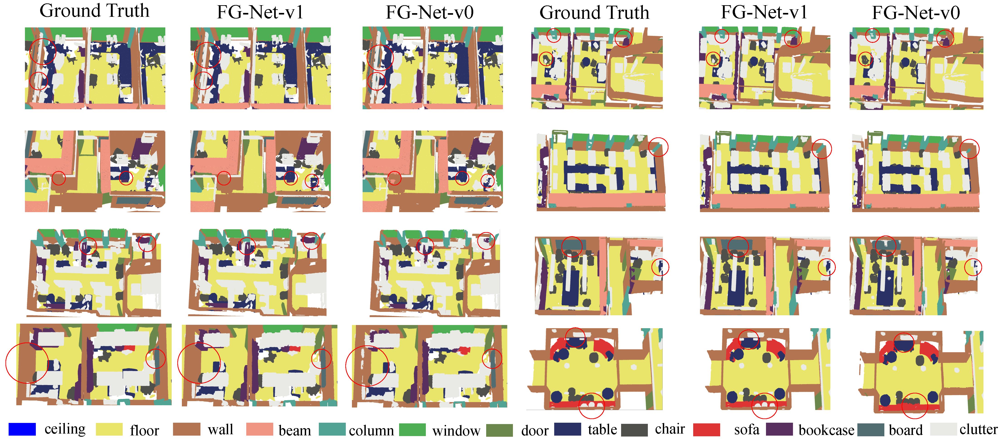

**Performance of Our Methods on Large-Scale Public Benchmarks:**

# Feature-Geometric-Net-FG-Net
**FG-Net: Fast Large-Scale LiDAR Point Clouds Understanding Network Leveraging Correlated Feature Mining and Geometric-Aware Modelling**

**Comparisons of Running Time of Our Method with SOTA methods RandLA and KPConv:** 
  
**Semantic Semgmentation Results on Area 1 of S3DIS Benchmark:** 
 

**Semantic Semgmentation Results on Area 2 of S3DIS Benchmark:** 

**Semantic Semgmentation Results on Area 3 of S3DIS Benchmark:** 
 

**Semantic Semgmentation Results on Area 4 of S3DIS Benchmark:** 
 

**Semantic Semgmentation Results on Area 5 of S3DIS Benchmark:** 
 

**Semantic Semgmentation Results on Area 6 of S3DIS Benchmark:** 

(./fig/Area_6.gif) 

**Semantic Semgmentation Results on Lille_1_1 of NPM3D Benchmark:** 
 

**Semantic Semgmentation Results on Lille_1_2 of NPM3D Benchmark:** 
 

**Semantic Semgmentation Results on Lille_2 of NPM3D Benchmark:** 
 

**Semantic Semgmentation Results on Paris of NPM3D Benchmark:** 
 

**Semantic Semgmentation Results on S3DIS Benchmark Whole Areas** 

**Detailed Semantic Semgmentation Results on S3DIS Benchmark** 

**Detailed Semantic Semgmentation Results on NPM3D Benchmark** 

**Detailed Semantic Semgmentation Results on Semantic3D Benchmark** 

**Detailed Semantic Semgmentation Results on PartNet Benchmark** 

**Detailed Semantic Semgmentation Results on SemanticKITTI Benchmark** 

**Semantic Semgmentation Results on Semantic3D Benchmark:** 

**Results on Birdfountain_station1_xyz_intensity_rgb** 
 
**Results on Castleblatten_station_1_intensity_rgb** 
 
**Results on Marketplacefeldkirch_station1_intensity_rgb** 
 
**Results on Marketplacefeldkirch_station4_intensity_rgb** 
 
**Results on Marketplacefeldkirch_station7_intensity_rgb** 
 
**Results on Sg27_Station10_rgb_intensity** 
 
**Results on Sg28_Station2_rgb_intensity** 

**Results on StGallenCathedral_station1_rgb_intensity** 

**Results on StGallenCathedral_station3_rgb_intensity** 

**Results on StGallenCathedral_station6_rgb_intensity** 

**Semantic Semgmentation Results on SemanticKITTI Benchmark:** 

**Results on Sequence 11-14 of SemanticKITTI Benchmark** 

**Results on Sequence 15-18 of SemanticKITTI Benchmark** 

**Results on Sequence 08 (Validation Set) of SemanticKITTI Benchmark** 

