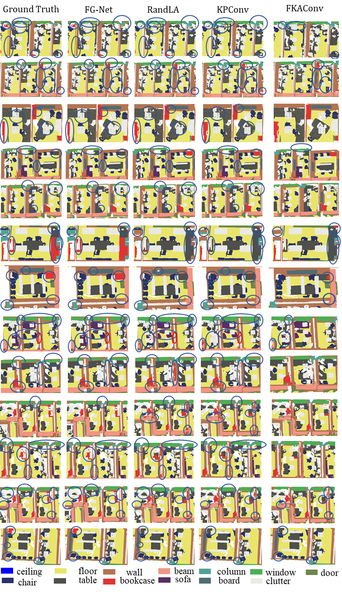
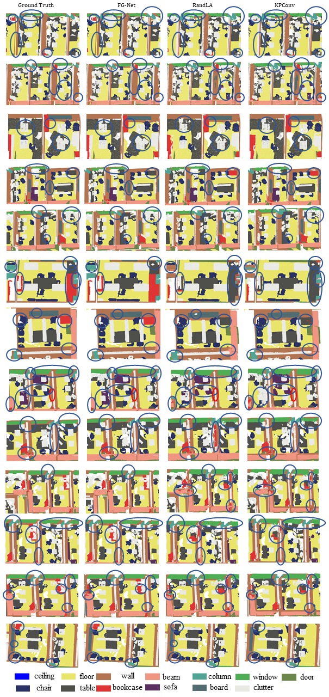
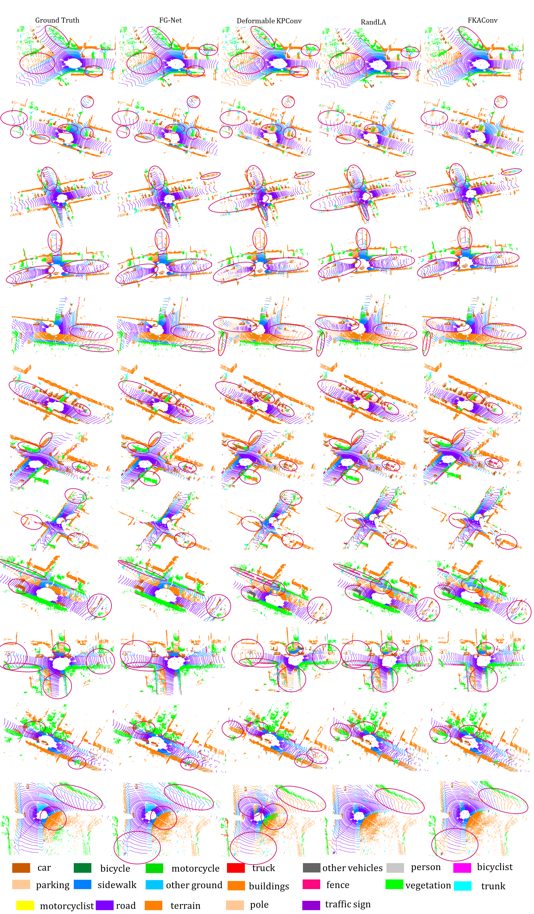
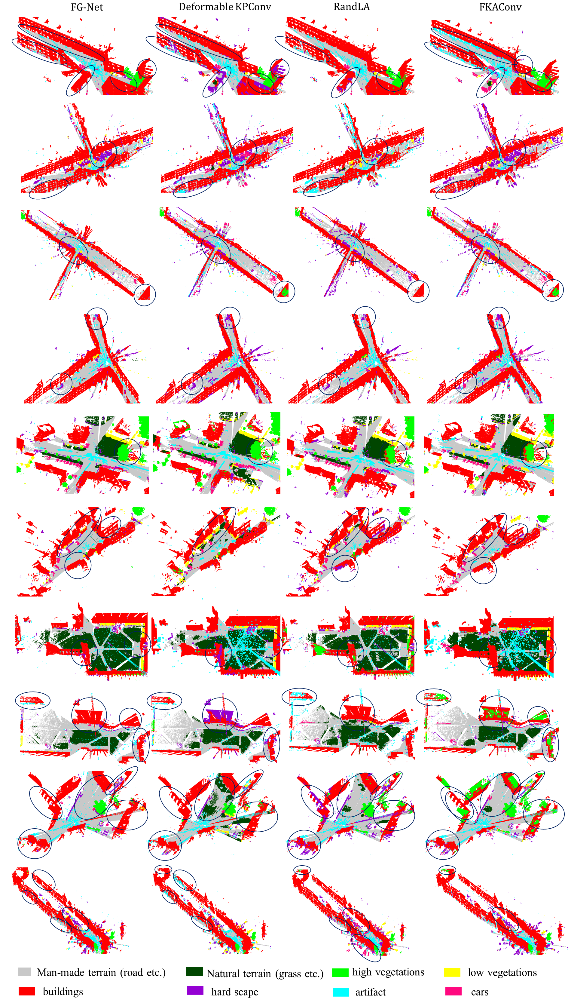
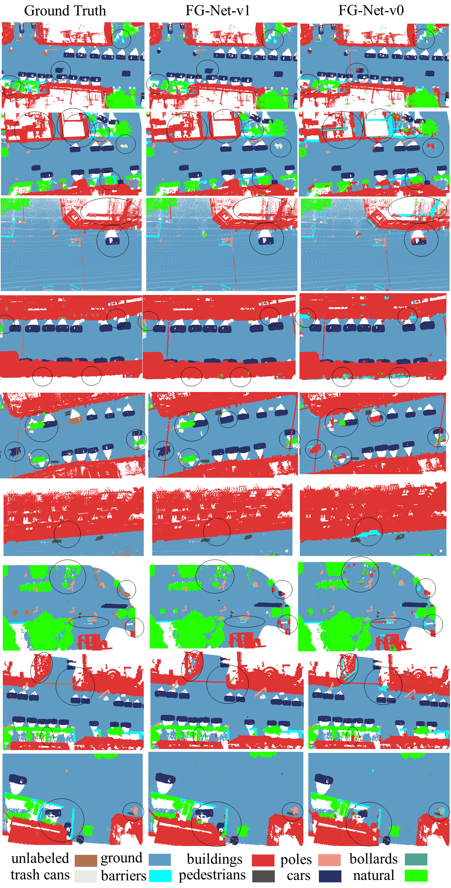
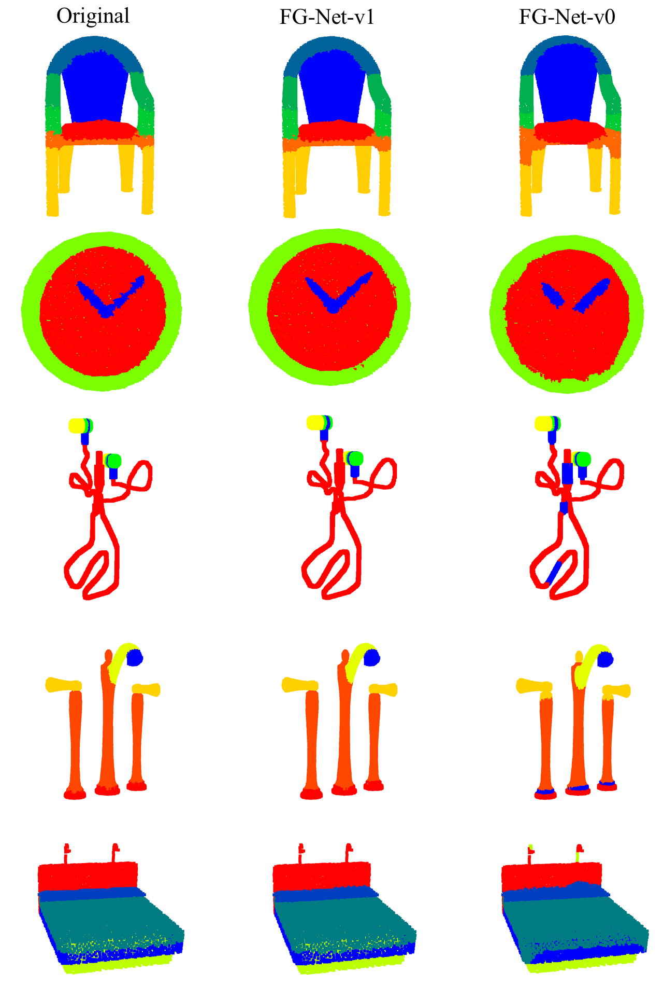

# Feature-Geometric-Net-FG-Net

**Comparisons of Running Time of Our Method with SOTA methods RandLA and KPConv:**<br />
**Comparisons on Sequence 12:** <br />

 <br />

**Comparisons on Sequence 13:** <br />

 <br />

**Comparisons on Sequence 14:** <br />

 <br />

**Comparisons on Sequence 15:** <br />

 <br />

**Comparisons on Sequence 16:** <br />

 <br />

**Semantic Semgmentation Results on Lille_1_1 of NPM3D Benchmark:**<br />

 

**Semantic Semgmentation Results on Lille_1_2 of NPM3D Benchmark:**<br />

 

**Semantic Semgmentation Results on Lille_2 of NPM3D Benchmark:**<br />

 

**Semantic Semgmentation Results on Paris of NPM3D Benchmark:**<br />

 

**Semantic Semgmentation Results on Area 1 of S3DIS Benchmark:**<br />

 

**Semantic Semgmentation Results on Area 2 of S3DIS Benchmark:**<br />


**Semantic Semgmentation Results on Area 3 of S3DIS Benchmark:**<br />

 

**Semantic Semgmentation Results on Area 4 of S3DIS Benchmark:**<br />

 

**Semantic Semgmentation Results on Area 5 of S3DIS Benchmark:**<br />

 

**Semantic Semgmentation Results on Area 6 of S3DIS Benchmark:**<br />

 


**Semantic Semgmentation Results on Semantic3D Benchmark:**<br />

**Results on Birdfountain_station1_xyz_intensity_rgb**<br />

 

**Results on Castleblatten_station_1_intensity_rgb**<br />

 

**Results on Marketplacefeldkirch_station1_intensity_rgb**<br />

 

**Results on Marketplacefeldkirch_station4_intensity_rgb**<br />

 

**Results on Marketplacefeldkirch_station7_intensity_rgb**<br />

 

**Results on Sg27_Station10_rgb_intensity**<br />

 

**Results on Sg28_Station2_rgb_intensity**<br />


**Results on StGallenCathedral_station1_rgb_intensity**<br />


**Results on StGallenCathedral_station3_rgb_intensity**<br />


**Results on StGallenCathedral_station6_rgb_intensity**<br />


**Semantic Semgmentation Results on SemanticKITTI Benchmark:**<br />

**Results on Sequence 11-14 of SemanticKITTI Benchmark**<br />


**Results on Sequence 15-18 of SemanticKITTI Benchmark**<br />


**Results on Sequence 08 (Validation Set) of SemanticKITTI Benchmark**<br />


**Visualizations of Kernel Deformations on S3DIS 1**<br />


**Visualizations of Kernel Deformations on S3DIS 2**<br />


<!-- [[**Visualizations of Kernel Deformations on S3DIS 3**<br />
](url)](url) -->
**Comparisons of Our Proposed FG-Net on S3DIS with Current SOTA Methods**<br />


    
**Comparisons of Our Proposed FG-Net on S3DIS with Current SOTA Methods**<br />




**Comparisons of Our Proposed FG-Net on SemanticKITTI with Current SOTA Methods**<br />



**Comparisons of Our Proposed FG-Net on Semantic3D with Current SOTA Methods**<br />



**Semantic Semgmentation Results on S3DIS Benchmark Whole Areas**<br />


**Detailed Semantic Semgmentation Results on S3DIS Benchmark**<br />


**Semantic Semgmentation Results on NPM3D Benchmark**<br />


**Detailed Semantic Semgmentation Results on NPM3D Benchmark**<br />


**Detailed Semantic Semgmentation Results on S3DIS Benchmark**<br />


**Detailed Semantic Semgmentation Results on SemanticKITTI Benchmark**<br />


**Detailed Semantic Semgmentation Results on Semantic3D Benchmark**<br />


**Detailed Semantic Semgmentation Results on PartNet Benchmark**<br />



**Detailed Semantic Semgmentation Results on SemanticKITTI Benchmark**<br />


# Summary of Work

This work presents FG-Net, a general deep learning framework for large-scale point clouds understanding without voxelizations, which achieves accurate and real-time performance with a single NVIDIA GTX 1080 GPU and an i7 CPU. First, a novel noise and outlier filtering method is designed to facilitate the subsequent high-level understanding tasks. For effective understanding purpose, we propose a novel plug-and-play module consisting of correlated feature mining and deformable convolution based geometric-aware modelling, in which the local feature relationships and point clouds geometric structures can be fully extracted and exploited. For the efficiency issue, we put forward a new composite inverse density sampling based and learning based operation and a feature pyramid based residual learning strategy to save the computational cost and memory consumption respectively. Compared with current methods which are only validated on limited datasets, we have done extensive experiments on eight real-world challenging benchmarks, which demonstrates that our approaches outperform state-of-the-art approaches in terms of both accuracy and efficiency. Moreover, weakly supervised transfer learning is also conducted to demonstrate the generalization capacity of our method. Source code, and representative results on the public benchmarks of our work are made publicly available to benefit the community.

### Acknowledgment
A portion of the code refers to <a href="https://github.com/jlblancoc/nanoflann">nanoflann</a> and the popular point based network Kernel Point Convolution <a href="https://github.com/HuguesTHOMAS/KPConv">KPConv</a>. Thank their contributions.


### License
The license is under the MIT license, see [LICENSE](./LICENSE).


### Citations

```
@article{liu2022fg,
  title={Fg-net: A fast and accurate framework for large-scale lidar point cloud understanding},
  author={Liu, Kangcheng and Gao, Zhi and Lin, Feng and Chen, Ben M},
  journal={IEEE Transactions on Cybernetics},
  volume={53},
  number={1},
  pages={553--564},
  year={2022},
  publisher={IEEE}
}

@inproceedings{liu2021fg,
  title={FG-Conv: Large-Scale LiDAR Point Clouds Understanding Leveraging Feature Correlation Mining and Geometric-Aware Modeling},
  author={Liu, Kangcheng and Gao, Zhi and Lin, Feng and Chen, Ben M},
  booktitle={2021 IEEE International Conference on Robotics and Automation (ICRA)},
  pages={12896--12902},
  year={2021},
  organization={IEEE}
}

```